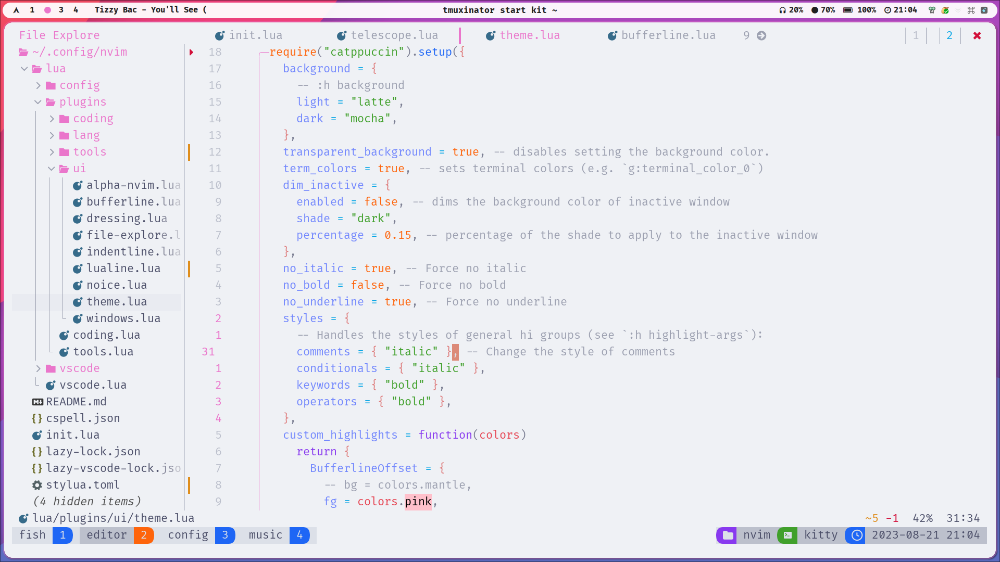
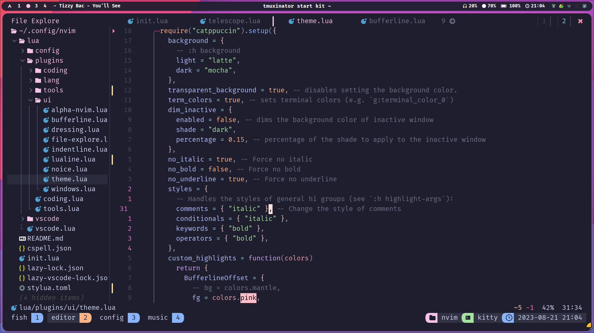
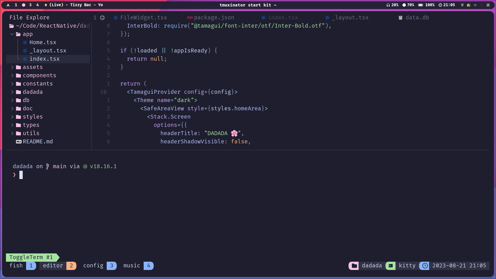

# ponvim

> 个人 Neovim 配置，基于 [lazy.nvim](https://github.com/folke/lazy.nvim) 进行插件管理，采用 [Catppuccin](https://github.com/catppuccin/nvim) 配色，面向前端（TypeScript / React）与日常开发优化。

## 截图

Light Mode



Dark Mode



React Project



## 特性

- 🚀 基于 [lazy.nvim](https://github.com/folke/lazy.nvim) 的懒加载插件管理
- 🎨 Catppuccin 主题，自动跟随系统浅色 / 深色模式（Latte / Mocha）
- 🔡 [blink.cmp](https://github.com/Saghen/blink.cmp) 补全 + LuaSnip 片段
- 🧠 Mason + nvim-lspconfig + typescript-tools 的 LSP 配置
- 🌳 Treesitter 语法高亮、折叠与文本对象
- 🪄 Conform 格式化 + nvim-lint 代码检查
- 🪟 全键盘操作：Telescope / fzf-lua / mini.files 多种查找方式
- 🗂️ 文件树（neo-tree）、Yazi、Neogit、Trouble 等工具
- 📁 会话持久化（persistence.nvim）与 Harpoon 快速跳转
- 💻 额外支持 VSCode 内嵌 Neovim（`vim.g.vscode` 模式）

## 依赖要求

- [Neovim](https://github.com/neovim/neovim) >= 0.9（推荐最新稳定版）
- [git](https://git-scm.com/)
- [ripgrep](https://github.com/BurntSushi/ripgrep) —— Telescope / fzf-lua 的 `live_grep` 依赖
- [Nerd Font](https://www.nerdfonts.com/) —— 图标显示
- 支持 true color 的终端

可选依赖（按需安装）：

| 工具 | 用途 |
| --- | --- |
| [lazygit](https://github.com/jesseduffield/lazygit) | Neogit 以外的终端 Git UI |
| [yazi](https://github.com/sxyazi/yazi) | 终端文件管理器 |
| [tmux](https://github.com/tmux/tmux) | 使用 `tmux.nvim` 进行窗格导航 |
| [stylua](https://github.com/JohnnyMorganz/StyLua) | Lua 格式化 |
| [prettierd](https://github.com/fsouza/prettierd) / [eslint_d](https://github.com/mantoni/eslint_d) | 前端格式化 |
| [black](https://github.com/psf/black) / [isort](https://github.com/PyCQA/isort) | Python 格式化 |
| `make` / Rust 工具链 | 部分插件编译（telescope-fzf-native、blink.cmp、LuaSnip） |

## 安装

1. 备份旧配置（可选）：

   ```bash
   mv ~/.config/nvim ~/.config/nvim.bak
   ```

2. 克隆仓库：

   ```bash
   git clone https://github.com/mayapony/ponvim.git ~/.config/nvim
   ```

3. 首次启动 Neovim，lazy.nvim 会自动安装并加载所有插件：

   ```bash
   nvim
   ```

4. 安装 LSP 服务器（由 Mason 自动安装，或手动执行）：

   ```text
   :Mason
   ```

   默认安装的 LSP 服务器：`lua_ls`、`tailwindcss`、`bashls`、`cssls`、`ts_ls`、`eslint`。

## 目录结构

```text
.
├── init.lua                    # 入口：加载 lazy.nvim 并分发配置
├── lazy-lock.json              # 插件版本锁定文件
├── lazy-vscode-lock.json       # VSCode 模式插件锁定文件
├── ftplugin/
│   └── java.lua                # Java 文件类型的局部选项
└── lua/
    ├── config/                 # 核心配置
    │   ├── options.lua         # 编辑器选项
    │   ├── keymaps.lua         # 全局快捷键
    │   ├── autocmd.lua         # 自动命令
    │   ├── global.lua          # 全局变量
    │   ├── function.lua        # 工具函数
    │   ├── lsp.lua             # LSP 回调与绑定
    │   └── icons.lua           # 图标定义
    ├── code/                   # VSCode 内嵌 Neovim 模式配置
    └── plugins/                # 插件配置（按分类拆分）
        ├── coding/             # 编辑与文本对象
        ├── lang/               # LSP、补全、语法
        ├── tools/              # 查找、Git、格式化等工具
        └── ui/                 # 主题、状态栏、文件树等 UI
```

## 插件概览

| 分类 | 插件 |
| --- | --- |
| 编辑 | mini.surround、mini.ai、mini.pairs、treesj、flash.nvim、nvim-ts-autotag、nvim-ts-context-commentstring |
| 补全 / LSP | blink.cmp、blink.compat、LuaSnip、friendly-snippets、mason.nvim、mason-lspconfig.nvim、nvim-lspconfig、typescript-tools.nvim、tsc.nvim |
| 语法 | nvim-treesitter、lazydev.nvim、luvit-meta |
| 查找 | telescope.nvim、telescope-fzf-native.nvim、fzf-lua、mini.files |
| Git | neogit、gitsigns.nvim、diffview.nvim |
| 格式化 / 检查 | conform.nvim、nvim-lint |
| UI | catppuccin、lualine.nvim、statuscol.nvim、dropbar.nvim、modes.nvim、noice.nvim、dressing.nvim、alpha-nvim、neo-tree.nvim、nvim-web-devicons、nvim-colorizer.lua |
| 折叠 | nvim-ufo |
| 其他工具 | trouble.nvim、which-key.nvim、harpoon、persistence.nvim、nvim-spectre、text-case.nvim、todo-comments.nvim、nvim-bufdel、tmux.nvim、yazi.nvim、hawtkeys.nvim、nvim-recorder、markdown.nvim、render-markdown.nvim |

## 快捷键

`<leader>` 为空格键 `<Space>`。安装 `which-key.nvim` 后按 `<leader>` 可查看分组提示。

### 通用

| 快捷键 | 描述 |
| --- | --- |
| `<C-s>` / `<leader>fs` | 保存文件 |
| `<leader>ml` | 打开 Lazy |
| `<leader>rc` | 重新加载配置 |
| `<leader>tn` | 切换行号 |
| `<esc>` | 退出并清除搜索高亮 |
| `s` / `S` | flash.nvim 跳转 / Treesitter 跳转 |

### 窗口与终端

| 快捷键 | 描述 |
| --- | --- |
| `<leader>ww` | 切换窗口 |
| `<leader>wd` | 关闭窗口 |
| `<leader>ws` | 右侧分屏 |
| `<leader>wv` | 下方分屏 |
| `<leader>wo` | 关闭其他窗口 |
| `<C-Up>` / `<C-Down>` | 增大 / 减小窗口高度 |
| `<C-Left>` / `<C-Right>` | 减小 / 增大窗口宽度 |
| `<C-t>` | 终端进入 Normal 模式 |
| `<C-h/j/k/l>` | 终端 / tmux 窗格导航 |

### 查找（Telescope / fzf-lua）

| 快捷键 | 描述 |
| --- | --- |
| `<leader>.` | 查找文件 |
| `<leader>/`、`<leader>fg` | 全局文本搜索 |
| `<leader>,` | 查找 buffer |
| `<leader>fh` | 查找帮助 |
| `<leader>fm` | 查找标记 |
| `<leader>fw` | 搜索光标下单词 |
| `<leader>fr` | 最近文件 |
| `<leader>fn` | Noice pick |
| `<leader>uC` | 切换配色 |
| `<leader>fd` | 查找 TODO |
| `<leader>fe` | mini.files 文件编辑器 |

### LSP / 诊断

| 快捷键 | 描述 |
| --- | --- |
| `<leader>mm` | 打开 Mason |
| `<leader>cr` | 重命名 |
| `<leader>ca` | Code Action |
| `gd` / `gr` / `gi` | 定义 / 引用 / 实现 |
| `gtd` / `gD` | 类型定义 / 声明 |
| `go` | 文档符号 |
| `gx` / `ge` | 诊断列表 / 浮动错误 |
| `K` / `<C-k>` | 悬浮文档 / 签名帮助 |
| `<leader>wa/wr/wl` | 工作区目录 增 / 删 / 列 |
| `<leader>xx` | 切换 Trouble 诊断 |
| `<leader>xX` | 当前 buffer 诊断 |
| `<leader>cs` | 符号 |
| `<leader>cl` | LSP 定义 / 引用 |
| `<leader>xL` / `<leader>xQ` | 位置列表 / Quickfix |
| `]x` / `[x` | 下一个 / 上一个诊断 |

### Git

| 快捷键 | 描述 |
| --- | --- |
| `<leader>gg` | 打开 Neogit |
| `<leader>gdo` / `<leader>gdc` | 打开 / 关闭 Diffview |
| `<leader>gdh` | Diffview 文件历史 |
| `]c` / `[c` | 下一个 / 上一个 hunk |
| `ih` | 选择 hunk（文本对象） |

### Buffer 与会话

| 快捷键 | 描述 |
| --- | --- |
| `<leader>qq` | 删除 buffer |
| `<leader>qo` | 删除其他 buffer |
| `<leader>qa` | 退出全部 |
| `<leader>qs` | 恢复会话 |
| `<leader>ql` | 恢复上次会话 |
| `<leader>qd` | 不保存当前会话 |

### Harpoon

| 快捷键 | 描述 |
| --- | --- |
| `<leader>hm` | 标记文件 |
| `<leader>ho` | 打开快速菜单 |
| `<leader>hp` / `<leader>hn` | 上一个 / 下一个 |
| `<leader>1` ~ `<leader>9` | 跳转到第 n 个标记 |

### 搜索替换（Spectre）

| 快捷键 | 描述 |
| --- | --- |
| `<leader>ss` | 切换 Spectre |
| `<leader>sw` | 搜索光标下单词 |
| `<leader>sp` | 在当前文件搜索 |

### 编辑 / 切换

| 快捷键 | 描述 |
| --- | --- |
| `<leader>cj` | Treesj 切换 join / split |
| `<leader>ck` | 文本大小写转换 |
| `<leader>tp` | 切换自动括号 |
| `<leader>tf` | 切换项目自动格式化 |
| `gsa` / `gsd` / `gsr` | mini.surround 添加 / 删除 / 替换 |
| `<leader>co` / `<leader>ci` | TypeScript 整理 / 补全 import |
| `<leader>cc` | TypeScript 类型检查（tsc.nvim） |

### UI 与文件

| 快捷键 | 描述 |
| --- | --- |
| `<leader>e` | 切换 Neo-tree |
| `<leader>-` / `<leader>ty` | 打开 Yazi |
| `<leader>snl` / `<leader>snh` | Noice 最近消息 / 历史 |
| `<leader>snd` | 关闭所有 Noice 通知 |
| `zR` / `zM` / `zr` / `zm` | 折叠操作（ufo） |

## VSCode 模式

当检测到 `vim.g.vscode` 时（即通过 [vscode-neovim](https://github.com/vscode-neovim/vscode-neovim) 在 VSCode 中使用），配置会加载 `lua/code/` 下的精简配置，将 Neovim 作为 VSCode 的编辑引擎：

- 使用独立的插件集合与锁文件 `lazy-vscode-lock.json`
- 快捷键通过 `vscode-neovim` 映射到 VSCode 命令（窗口导航、折叠、代码操作等）
- 仅加载 treesitter、treesj、mini.surround、flash.nvim 等轻量插件

## 致谢

本配置参考了以下项目与社区：

- [folke/lazy.nvim](https://github.com/folke/lazy.nvim)
- [LazyVim](https://github.com/LazyVim/LazyVim)
- [catppuccin/nvim](https://github.com/catppuccin/nvim)
- [vscode-neovim](https://github.com/vscode-neovim/vscode-neovim)

## License

MIT
